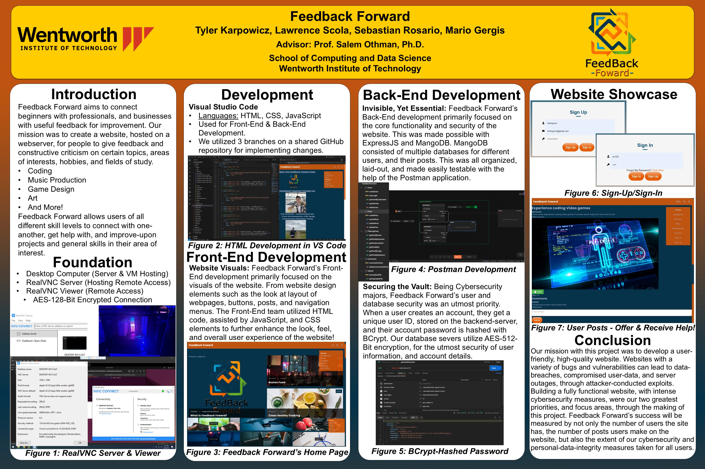

Text can be **bold**, _italic_, ~~strikethrough~~ or `keyword`.

[Link to another page](./another-page.html).

There should be whitespace between paragraphs.

There should be whitespace between paragraphs. We recommend including a README, or a file with information about your project.

# Header 1

This is a normal paragraph following a header. GitHub is a code hosting platform for version control and collaboration. It lets you and others work together on projects from anywhere.

## Table of Contents
* * *
- Confluence Guides & Documentations
  - Confluence Guides & Documentations (Created at Raytheon BBN Technologies)
- PowerShell Scripts
  - PowerShell Scripts (Created for Personal Use)
  - PowerShell Scripts (Created at Raytheon BBN Technologies)
  - PowerShell Scripts (From PowerShell 7 Guide & Documentation)
- Projects: Cybersecurity, Computer Networking, and Computer Science
  - Feedback Forward - A Social Media Platform for Aspiring Individuals
  - Creating A Virtual Enterprise - A Virtual Environment Resembling the Computing, Network & Access Control Infrastructure of a Business
- Resume & Contact Information

## Header 2

> This is a blockquote following a header.
>
> When something is important enough, you do it even if the odds are not in your favor.

### Header 3

```js
// Javascript code with syntax highlighting.
var fun = function lang(l) {
  dateformat.i18n = require('./lang/' + l)
  return true;
}
```

```ruby
# Ruby code with syntax highlighting
GitHubPages::Dependencies.gems.each do |gem, version|
  s.add_dependency(gem, "= #{version}")
end
```

#### Header 4

*   This is an unordered list following a header.
*   This is an unordered list following a header.
*   This is an unordered list following a header.

##### Header 5

1.  This is an ordered list following a header.
2.  This is an ordered list following a header.
3.  This is an ordered list following a header.

## Guides & Documentations

###### Confluence Guides & Documentations (Created at Raytheon BBN Technologies)

| File Name        | Script Overview          | Source Code |
|:-------------|:------------------|:------|
| HourlyFolderBackup.ps1           | Hourly Folder Backup (Formatted Subpage) | HourlyFolderBackup.ps1 (Link to Script in Repo)  |
| out of stock | good and plenty   | nice  |
| ok           | good `oreos`      | hmm   |
| ok           | good `zoute` drop | yumm  |

## PowerShell Scripts
<!--| HourlyFolderBackup.ps1 | Hourly Folder Backup (Formatted Subpage) | [HourlyFolderBackup.ps1](./Cybersecurity_Projects/Personal PowerShell Scripts/HourlyFolderBackup.ps1) |-->
###### PowerShell Scripts (Created for Personal Use)

| File Name        | Script Overview          | Source Code |
|:-------------|:------------------|:------|
| HourlyFolderBackup.ps1 | Hourly Folder Backup (Formatted Subpage) | [HourlyFolderBackup.ps1](https://github.com/karpowicztatwit/tyler_karpowicz/blob/main/Cybersecurity_Projects/Personal%20PowerShell%20Scripts/HourlyFolderBackup.ps1) |

###### PowerShell Scripts (Created at Raytheon BBN Technologies)

| File Name        | Script Overview          | Source Code |
|:-------------|:------------------|:------|
| WindowsADScrape.ps1 | Scrapes Windows OS Versions of AD Users & Outputs a Detailed List | [WindowsADScrape.ps1](https://github.com/karpowicztatwit/tyler_karpowicz/blob/main/Raytheon_Portfolio/PowerShell%20Scripts/WindowsADScrape.ps1)  |
| CreateFileStructure.ps1 | Inititalizes Directory Strucutre for Secure Systems | [CreateFileStructure.ps1](https://github.com/karpowicztatwit/tyler_karpowicz/blob/main/Raytheon_Portfolio/PowerShell%20Scripts/CreateFileStructure.ps1) |
| [Collection] PowerShell 7 Guide & Documentation Scripts | good `oreos`      | hmm   |


###### Header 6

| head1        | head two          | three |
|:-------------|:------------------|:------|
| ok           | good swedish fish | nice  |
| out of stock | good and plenty   | nice  |
| ok           | good `oreos`      | hmm   |
| ok           | good `zoute` drop | yumm  |

### There's a horizontal rule below this.

* * *

### Here is an unordered list:

*   Item foo
*   Item bar
*   Item baz
*   Item zip

### And an ordered list:

1.  Item one
1.  Item two
1.  Item three
1.  Item four

### And a nested list:

- level 1 item
  - level 2 item
  - level 2 item
    - level 3 item
    - level 3 item
- level 1 item
  - level 2 item
  - level 2 item
  - level 2 item
- level 1 item
  - level 2 item
  - level 2 item
- level 1 item

### Small image


## Projects: Cybersecurity, Computer Networking, and Computer Science
### Feedback Forward - A Social Media Platform for Aspiring Individuals

**Project Contributors:** Tyler Karpowicz, Sebastian Rosario, Lawrence Scola, Mario Gergis

[Feedback Forward's GitHub Repository](https://github.com/sebastianrosario/FeedbackForward)

<!--Offical Detailed Poster-->


Worked alongside three fellow students to create a website locally hosted on a webserver. This website allows people to provide feedback and constructive criticism on various topics, areas of interest, hobbies, and fields of study. Feedback Forward aims to connect beginners, professionals, and businesses with useful feedback for improvement. Feedback Forward allows users of all different skill levels to connect with one-another, get help with, and improve-upon projects and general skills in their area of interest. Examples include: Coding, Music Production, Game Design, Art, and more!

<!--Unofficial Overview Poster-->


### Creating A Virtual Enterprise - A Virtual Environment Resembling the Computing, Network & Access Control Infrastructure of a Business
<!--Insert Project Contents Here-->

## Resume & Contact Information
<dl>
<dt>Name</dt>
<dd>Tyler James Karpowicz</dd>
<dt>Email</dt>
<dd>tkarpbusiness@gmail.com</dd>
<dt>Phone Number</dt>
<dd>+1 (631) 432-4019</dd>
<dt>Location</dt>
<dd>Sayville, New York, USA</dd>
</dl>

<!---->
<!--<iframe src="Resume/Tyler_Karpowicz's_Resume.pdf" width="800" height="600"></iframe>-->
<embed src="Resume/Tyler_Karpowicz's_Resume.pdf" width="850px" height="1000px"/>

### Definition lists can be used with HTML syntax.

<dl>
<dt>Name</dt>
<dd>Godzilla</dd>
<dt>Born</dt>
<dd>1952</dd>
<dt>Birthplace</dt>
<dd>Japan</dd>
<dt>Color</dt>
<dd>Green</dd>
</dl>

```
Long, single-line code blocks should not wrap. They should horizontally scroll if they are too long. This line should be long enough to demonstrate this.
```

```
The final element.
```
